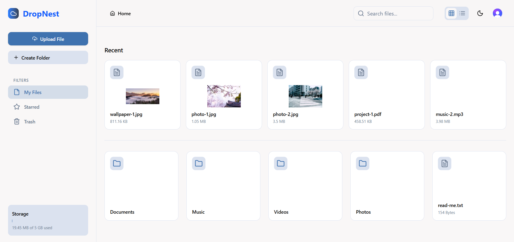

# DropNest

DropNest is a full-stack, Dropbox-inspired file storage application built for performance and a complete user experience. It provides a full suite of file and folder management tools, built on a modern, scalable, and serverless technology stack.

<br />
<p align="center">
<a href="https-your-live-url.vercel.app">
<!-- You can add a screenshot or a GIF of your app here! -->

</a>
</p>

## Features

DropNest is built with a focus on core utility and a polished, responsive user interface.

### File & Folder Operations

**Core Management:** Create, rename, and manage files and folders within a nested hierarchy.

**Drag & Drop:** Intuitively move items into folders or upload new files from your desktop with real-time progress tracking.

**Bulk Actions:** Use Ctrl/Cmd and Shift keys to select multiple items for bulk operations like Move, Copy, Star, and Delete.

**Trash & Recovery:** Soft-delete items to a trash bin, where they can be restored or deleted permanently.

### Advanced Functionality

**Efficient Search:** A powerful backend search instantly finds files and folders across your entire drive.

**Shareable Links:** Generate secure, view-only links for any file to share publicly.

**File Previews:** View common file types directly in the app, with a feature-rich image lightbox, in-browser PDF viewing, and embedded media players.

### User Interface & Experience

**Dual Views:** Switch between a visual Grid View and a detailed List View to suit your workflow.

**Optimistic UI Updates:** Actions like moving or deleting files feel instant by updating the UI before the server responds.

**Comprehensive Feedback System:** Get clear feedback through action toasts, see individual file loading states, and track all background jobs (uploads, copies) in a persistent Global Activity Center.

**Polished Loading States:** The application uses high-fidelity skeleton loaders that precisely mimic the final layout, preventing content flashing and layout shifts during initial page load.

**Context-Aware UI:** The interface adapts to your current view, showing "Restore" only in the Trash or disabling "Copy" for folders.

**Dark & Light Mode:** A seamless theme toggle for user preference.

**Secure Authentication:** Complete user authentication flow (Sign Up & Sign In) powered by Clerk.

## Tech Stack

This project uses a modern, type-safe, and serverless technology stack.

| Category | Technology | Purpose |
|----------|------------|---------|
| Framework | Next.js (App Router) | Full-stack framework with React Server Components for performance and an improved developer experience. |
| Authentication | Clerk | Complete user management solution for authentication, session handling, and security. |
| Database | Neon | Serverless PostgreSQL for a scalable, pay-as-you-go database. |
| ORM | Drizzle ORM | A modern, type-safe SQL-like ORM for database interaction. |
| File Storage | ImageKit | Manages all file storage, delivery, and real-time transformations. |
| State | Zustand | Implements the "Smart Store" architecture for all global state and business logic. |
| UI Components | Shadcn/UI | A collection of accessible and reusable components. |
| Drag & Drop | dnd-kit | A modern and accessible toolkit for building performant drag-and-drop interfaces. |
| Validation | Zod | Schema validation for both client-side forms and server-side API routes. |
| UI Feedback | Sonner | A powerful toasting library for providing users with feedback on operations. |
| Forms | React Hook Form | Performant and flexible form state management. |

## Architecture

DropNest is built with a clean, decoupled architecture pattern: "Smart Store, Dumb Components". This ensures the application is maintainable, testable, and scalable.

**The "Brain" (Zustand Store):** The global Zustand store (useFileStore) acts as the single source of truth. It contains all application state and business logic. API calls, state mutations, and complex operations are defined as "actions" within the store. These actions are designed to be "silent"—they perform their task and update the state without creating UI side effects.

**The "View" (React Components):** React components are kept as "dumb" as possible. Their primary role is to render the UI based on state they select from the store and to call store actions in response to user events.

**The "View Controller" (DashboardClient.tsx):** A primary client component orchestrates the connection between the "View" and the "Brain." It calls the store's silent actions and wraps them in UI feedback (like toast.promise), cleanly separating core logic from UI presentation.

## Running Locally

Follow these instructions to get a copy of the project up and running on your local machine.

### Prerequisites

- Node.js (v18 or later)
- Git
- A Clerk account
- A Neon account for the PostgreSQL database
- An ImageKit account

### 1. Clone the Repository

```bash
git clone https://github.com/your-username/dropnest.git
cd dropnest
```

### 2. Install Dependencies

```bash
npm install
```

### 3. Set Up Environment Variables

Create a `.env.local` file in the root of your project by copying the example file.

```bash
cp .env.example .env.local
```

Now, fill in the `.env.local` file with your credentials from each service.

```env
# Neon Database Connection String
DATABASE_URL="your_neon_connection_string"

# Clerk Authentication Keys
NEXT_PUBLIC_CLERK_PUBLISHABLE_KEY="pk_..."
CLERK_SECRET_KEY="sk_..."
NEXT_PUBLIC_CLERK_SIGN_IN_URL=/sign-in
NEXT_PUBLIC_CLERK_SIGN_UP_URL=/sign-up
NEXT_PUBLIC_CLERK_AFTER_SIGN_IN_URL=/dashboard
NEXT_PUBLIC_CLERK_AFTER_SIGN_UP_URL=/dashboard

# ImageKit Credentials
IMAGEKIT_PUBLIC_KEY="public_..."
IMAGEKIT_PRIVATE_KEY="private_..."
IMAGEKIT_URL_ENDPOINT="https://ik.imagekit.io/your_instance/"

# Application URL
NEXT_PUBLIC_APP_URL="http://localhost:3000"
```

### 4. Set Up the Database

Run the Drizzle Kit migrations to set up your database schema.

```bash
# This command applies the migrations to your database
npm run db:migrate
```

### 5. Run the Development Server

```bash
npm run dev
```

Open `http://localhost:3000` with your browser to see the result.

---

## License

This project is licensed under the MIT License.
